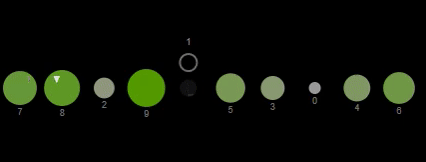
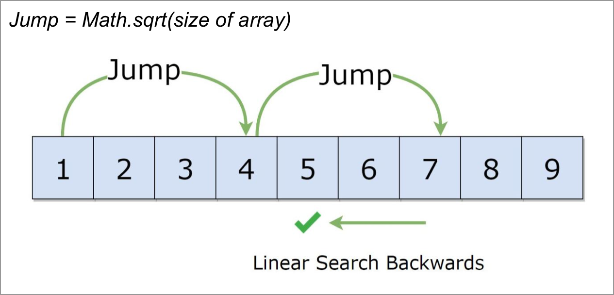
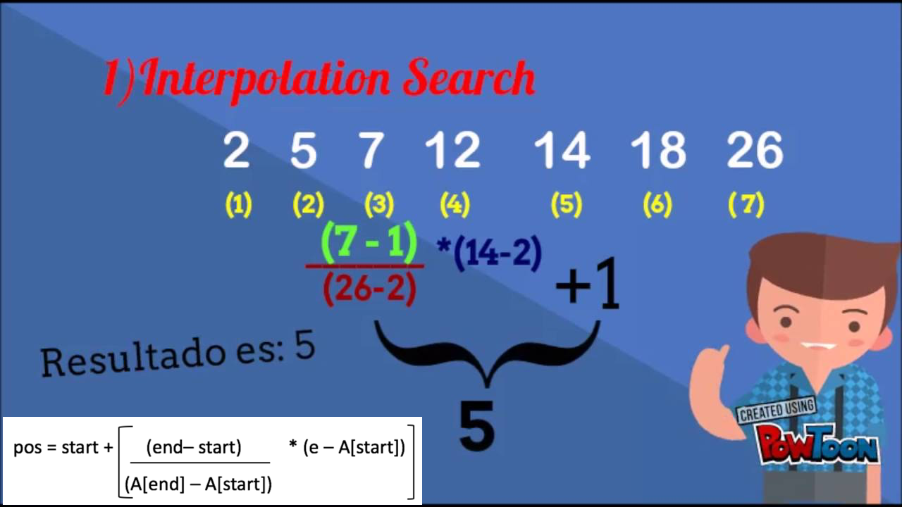
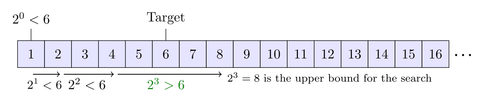
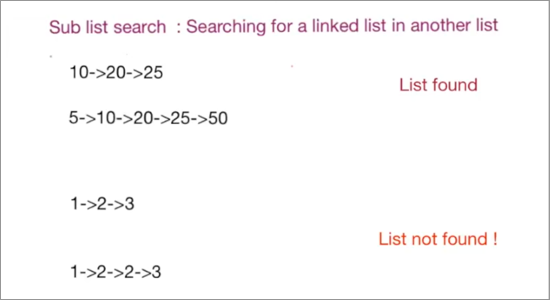
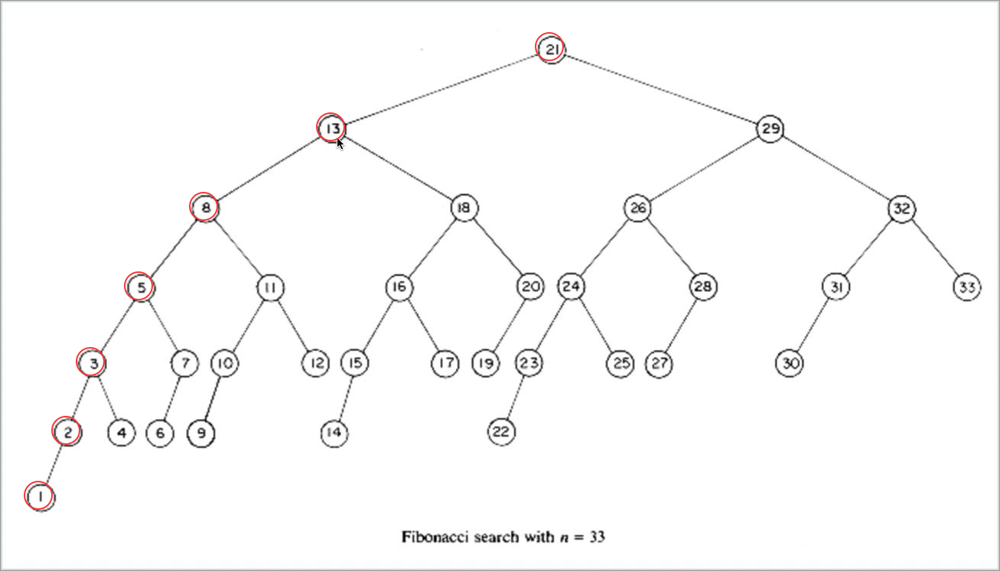

# The Algorithms - Kotlin

### All algorithms implemented in Kotlin (for education)

## I. Sort Algorithms

### 1.1 Insertion Sort

From [Wikipedia](https://en.wikipedia.org/wiki/Insertion_sort): Insertion sort is a simple sorting algorithm that builds the final sorted array (or list) one item at a time. It is much less efficient on large lists than more advanced algorithms such as quicksort, heapsort, or merge sort

__Properties__
* Worst case performance O(n^2)
* Best case performance O(n)
* Average case performance O(n^2)

### 1.2 Selection Sort

From [Wikipedia](https://en.wikipedia.org/wiki/Insertion_sort): Insertion sort is a simple sorting algorithm that builds the final sorted array (or list) one item at a time. It is much less efficient on large lists than more advanced algorithms such as quicksort, heapsort, or merge sort

__Properties__
* Worst case performance O(n^2)
* Best case performance O(n)
* Average case performance O(n^2)

### 1.3 Bubble Sort

From [Wikipedia](https://en.wikipedia.org/wiki/Bubble_sort): Bubble sort, sometimes referred to as sinking sort, is a simple sorting algorithm that repeatedly steps through the list to be sorted, compares each pair of adjacent items and swaps them if they are in the wrong order. The pass through the list is repeated until no swaps are needed, which indicates that the list is sorted.

__Properties__
* Worst case performance O(n^2)
* Best case performance O(n)
* Average case performance O(n^2)

### 1.4 Shell Sort

From [Wikipedia](https://en.wikipedia.org/wiki/Shellsort): Shellsort is a generalization of insertion sort that allows the exchange of items that are far apart. The idea is to arrange the list of elements so that, starting anywhere, considering every hth element gives a sorted list. Such a list is said to be h-sorted.

__Properties__
* Worst case performance O(nlog2 2n)
* Best case performance O(n log n)
* Average case performance depends on gap sequence

### 1.5 Merge Sort

From [Wikipedia](https://en.wikipedia.org/wiki/Merge_sort): merge sort is a divide and conquer algorithm that was invented by John von Neumann in 1945.

__Properties__
* The performance of this algorithm is O(n log n)

### 1.6 Quick Sort

From [Wikipedia](https://en.wikipedia.org/wiki/Quicksort): Quicksort is a divide and conquer algorithm. Quicksort first divides a large array into two smaller sub-arrays: the low elements and the high elements. Quicksort can then recursively sort the sub-arrays.

__Properties__
* Worst case performance O(n^2)
* Best case performance O(n log n) or O(n) with three-way partition
* Average case performance O(n^2)

### 1.7 Heap Sort

From [Wikipedia](https://en.wikipedia.org/wiki/Heapsort): the heapsort algorithm involves preparing the list by first turning it into a max heap. The algorithm then repeatedly swaps the first value of the list with the last value, decreasing the range of values considered in the heap operation by one, and sifting the new first value into its position in the heap. This repeats until the range of considered values is one value in length.

__Properties__
* The performance buildMaxHeap() operation is run once, and is O(n)
* The performance siftDown() function is O(log n), and is called n times
* Therefore performance of this algorithm is O(n + n log n) = O(n log n).

## II. Search Algorithms

### 2.1 Linear Search.

From [Wikipedia](https://en.wikipedia.org/wiki/Linear_search): linear search or sequential search is a method for finding a target value within a list. It sequentially checks each element of the list for the target value until a match is found or until all the elements have been searched

__Properties__
* Worst-case performance O(n)
* Best-case performance O(1)
* Average performance O(n)

### 2.2 Binary Search.

From [Wikipedia](https://en.wikipedia.org/wiki/Binary_search_algorithm): Binary search, also known as half-interval search or logarithmic search, is a search algorithm that finds the position of a target value within a sorted array. It compares the target value to the middle element of the array; if they are unequal, the half in which the target cannot lie is eliminated and the search continues on the remaining half until it is successful.

__Properties__
* Worst case performance O(log n)
* Best case performance O(1)
* Average case performance O(log n)

### 2.3 Jump Search.

From [Wikipedia](https://en.wikipedia.org/wiki/Jump_search): jump search or block search refers to a search algorithm for ordered lists. It works by first checking all items Lkm, where {\displaystyle k\in \mathbb {N} } k\in \mathbb {N}  and m is the block size, until an item is found that is larger than the search key. To find the exact position of the search key in the list a linear search.

__Properties__
* Worst case performance O(√ n)
* Best case performance O(1)
* Average case performance O(√ n)

### 2.4 Interpolation Search.

From [Wikipedia](https://en.wikipedia.org/wiki/Interpolation_search): Interpolation search is an algorithm for searching for a key in an array that has been ordered by numerical values assigned to the keys (key values). It was first described by W. W. Peterson in 1957.

__Properties__
* Worst case performance O(n)
* Best case performance  O(log log n))
* Average case performance O(n)

### 2.5 Exponential Search.

From [Wikipedia](https://en.wikipedia.org/wiki/Exponential_search): Exponential search allows for searching through a sorted, unbounded list for a specified input value (the search "key"). The algorithm consists of two stages. The first stage determines a range in which the search key would reside if it were in the list. In the second stage, a binary search is performed on this range.

__Properties__
* The first stage of the algorithm takes O(log i) time
* The second part of the algorithm also takes O(log i) time
* Calculated by summing the runtimes of the two stages, of O(log i) + O(log i) = 2 O(log i) = O(log i)

### 2.6 Sublist Search (Search a linked list in another list)

From [GeeksforGeeks](https://www.geeksforgeeks.org/sublist-search-search-a-linked-list-in-another-list/): Given two linked lists, the task is to check whether the first list is present in 2nd list or not.

__Properties__
* Time Complexity : O(m*n) where m is the number of nodes in second list and n in first.

### 2.7 Fibonacci Search.

From [Wikipedia](https://en.wikipedia.org/wiki/Fibonacci_search_technique): Fibonacci search technique is a method of searching a sorted array using a divide and conquer algorithm that narrows down possible locations with the aid of Fibonacci numbers.

__Properties__
* Worst case performance O(log n)
* Best case performance  O(1)
* Average case performance O(log n)
* Average space complexity O(1)

### 2.8 The Ubiquitous Binary Search.

### 2.9 TernarySearch

### 2.10 Saddleback Search

### 2.11 Golden-section search
